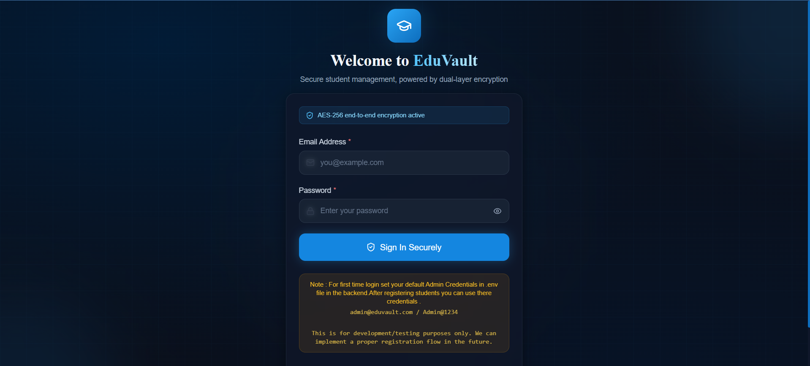

# EduVault — Student Management System

A full-stack Student Management application built with **React + TypeScript** (frontend) and **Node.js + Express + TypeScript** (backend), featuring **2-Level AES-256-CBC encryption** for all student data.

---

## Tech Stack

| Layer | Technology |
|-------|-----------|
| Frontend | React 18, TypeScript, Vite, Tailwind CSS |
| Backend | Node.js, Express, TypeScript |
| Database | MongoDB (Mongoose) |
| Encryption | AES-256-CBC (CryptoJS frontend / Node crypto backend) |
| Routing | React Router DOM v6 |

---

## Folder Structure

```
task-react-node-typescript/
├── client/                         ← React Frontend (Vite)
│   ├── src/
│   │   ├── components/
│   │   │   ├── LoginForm.tsx       ← Login UI + validation
│   │   │   ├── StudentForm.tsx     ← Registration/Edit form (8 fields)
│   │   │   ├── StudentList.tsx     ← Table + mobile cards + CRUD actions
│   │   │   ├── Navbar.tsx          ← Top navigation bar
│   │   │   ├── Modal.tsx           ← Reusable modal wrapper
│   │   │   ├── ConfirmDialog.tsx   ← Delete confirmation dialog
│   │   │   ├── InputField.tsx      ← Reusable input with error display
│   │   │   ├── SelectField.tsx     ← Reusable select dropdown
│   │   │   ├── TextAreaField.tsx   ← Reusable textarea
│   │   │   ├── LoadingSpinner.tsx  ← Spinner component
│   │   │   └── StatsCard.tsx       ← Dashboard metric card
│   │   ├── pages/
│   │   │   ├── LoginPage.tsx       ← Login page
│   │   │   └── DashboardPage.tsx   ← Main dashboard
│   │   ├── context/
│   │   │   └── AuthContext.tsx     ← Global auth state
│   │   ├── utils/
│   │   │   ├── crypto.ts           ← Frontend AES encrypt/decrypt (Level 1)
│   │   │   ├── api.ts              ← Axios API calls
│   │   │   └── validation.ts       ← Form validation functions
│   │   ├── types/
│   │   │   └── index.ts            ← TypeScript interfaces
│   │   ├── App.tsx                 ← Routes
│   │   ├── main.tsx                ← Entry point
│   │   └── index.css               ← Tailwind + custom styles
│   ├── .env                        ← Frontend env vars (VITE_CRYPTO_KEY)
│   └── vite.config.ts
│
├── server/                         ← Node.js Backend
│   ├── src/
│   │   ├── controllers/
│   │   │   └── studentController.ts ← CRUD + encryption pipeline
│   │   ├── middleware/
│   │   │   └── errorHandler.ts     ← Global error handler
│   │   ├── models/
│   │   │   └── Student.ts          ← Mongoose schema
│   │   ├── routes/
│   │   │   └── studentRoutes.ts    ← API route definitions
│   │   ├── utils/
│   │   │   └── crypto.ts           ← Backend AES encrypt/decrypt (Level 2)
│   │   ├── app.ts                  ← Express setup
│   │   └── server.ts               ← Entry point
│   └── .env                        ← Backend env vars (CRYPTO_SECRET_KEY)
│
└── README.md
```

---

## 2-Level Encryption Explained

```
SAVING DATA (Register / Update):
  User Input (plain text)
      ↓
  [Frontend — AES-256-CBC with VITE_CRYPTO_KEY]
      ↓
  Level-1 Encrypted  →  Sent over network to backend
      ↓
  [Backend — AES-256-CBC with CRYPTO_SECRET_KEY]
      ↓
  Level-2 Encrypted  →  Stored in MongoDB

READING DATA (Fetch students):
  MongoDB (Level-2 Encrypted)
      ↓
  [Backend decrypts with CRYPTO_SECRET_KEY]
      ↓
  Level-1 Encrypted  →  Sent over network to frontend
      ↓
  [Frontend decrypts with VITE_CRYPTO_KEY]
      ↓
  Plain Text  →  Displayed to user
```

**Two separate AES keys** mean:
- MongoDB never holds plain text
- The network response is still encrypted (Level-1)
- Both keys must be compromised together to read any data

---

## Setup & Running

### Prerequisites
- Node.js >= 18
- MongoDB running locally on port 27017

### 1. Clone & Install

```bash
# Install backend dependencies
cd server
npm install

# Install frontend dependencies
cd ../client
npm install
```

### 2. Configure Environment

**server/.env**
```env
PORT=5000
MONGO_URI=mongodb://localhost:27017/student_management
# Backend AES Encryption Key (32 chars for AES-256)
CRYPTO_SECRET_KEY=b@ckEnd$3cr3tK3y!AES256Str0ngKey
# ADD THIS — must match client/.env VITE_CRYPTO_KEY exactly
FRONTEND_CRYPTO_KEY=fr0ntEnd$3cr3tK3y!AES128Str0ng
# Admin credentials for first-time login
ADMIN_EMAIL=admin@eduvault.com
ADMIN_PASSWORD=Admin@1234

Note : After registration of student we can use the student's credentials for login.
```

**client/.env**
```env
# API base URL (proxied via vite.config.ts in dev)
VITE_API_BASE_URL=http://localhost:5000/api
# Frontend AES-256 encryption key (Level 1)
VITE_CRYPTO_KEY=fr0ntEnd$3cr3tK3y!AES128Str0ng
```

> ⚠️ `CRYPTO_SECRET_KEY` and `VITE_CRYPTO_KEY` **must be different** for proper 2-layer security.

### 3. Run

```bash
# Terminal 1 — Start backend
cd server
npm run dev

# Terminal 2 — Start frontend
cd client
npm run dev
```

- Frontend: http://localhost:5173  
- Backend API: http://localhost:5000

---

## API Endpoints

| Method | Route | Description |
|--------|-------|-------------|
| POST | `/api/login` | Login (Level-1 encrypted body) |
| POST | `/api/register` | Register new student |
| GET | `/api/students` | Get all students (returns Level-1 encrypted) |
| PUT | `/api/student/:id` | Update student by ID |
| DELETE | `/api/student/:id` | Delete student by ID |
| GET | `/health` | Server health check |

---

## Features

- ✅ Login with email + password validation
- ✅ Register student with 8 fields + full validation
- ✅ View all students (table on desktop, cards on mobile)
- ✅ Edit student details
- ✅ Delete student with confirmation dialog
- ✅ Search by name, email, phone, course
- ✅ Filter by gender and course
- ✅ Pagination with configurable page size
- ✅ 2-Level AES-256-CBC encryption pipeline
- ✅ Responsive design (mobile + tablet + desktop)
- ✅ Protected routes (redirect to login if not authenticated)
- ✅ Toast notifications for all actions


## Login Page

